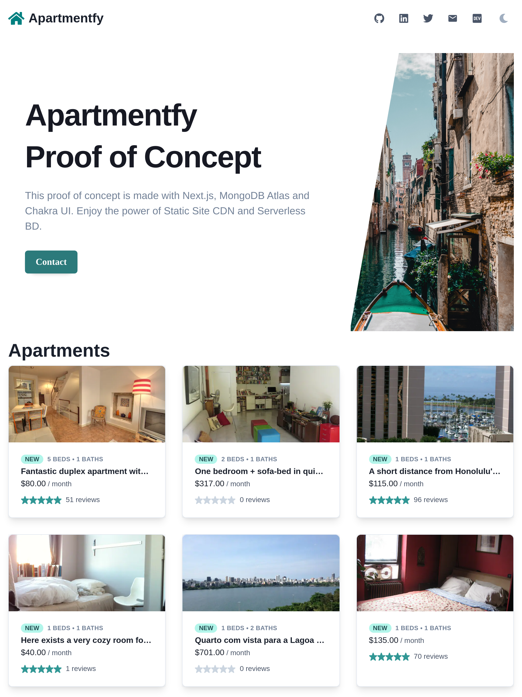
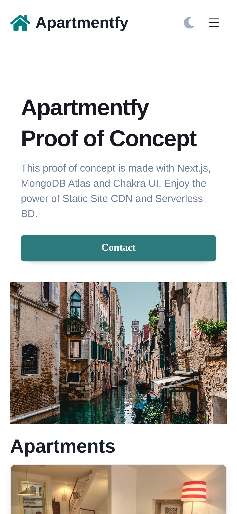

# Apartmentfy

## What I've done

- [x] Conection between Next.js and MongoDB Atlas
- [x] Using search capabilities of MongoDB Atlas
- [x] Using Chakra UI as a component library

## Setup

Create a file .env.local with the following parameters of your MongoDB Atlas DB.

```sh
MONGODB_URI=
MONGODB_DB=
```

## Screenshots



